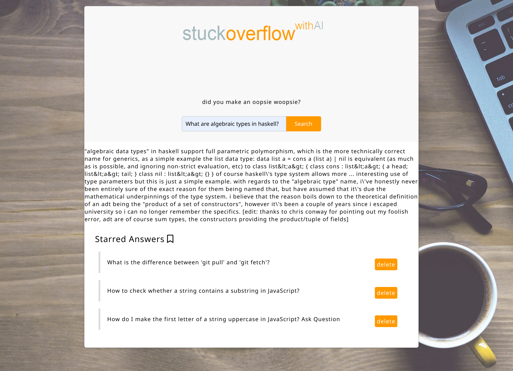

# StuckOverflow - an AI driven developer tool that generates an answer to your technology questions.

cd to root directory and add the flask app to your environment variables using: `export FLASK_APP=app.py`. Host the flask serve by running the command `flask run`.

This software was the final result of the AI Camp 1-day hackathon. A team of 3 worked on the project and together we won the hackathon.

